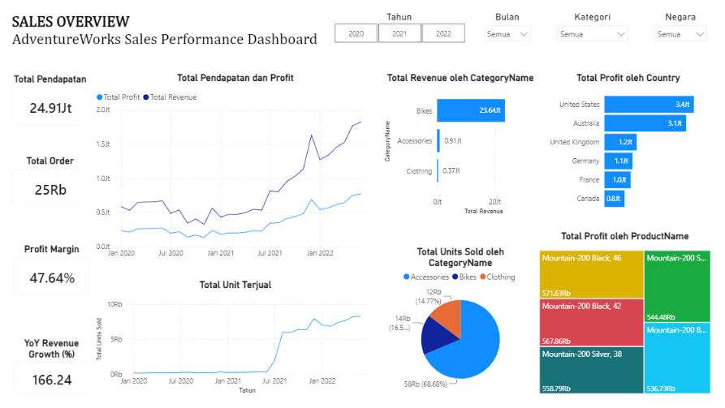
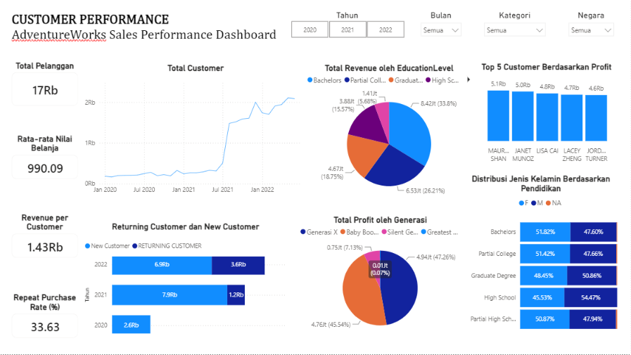
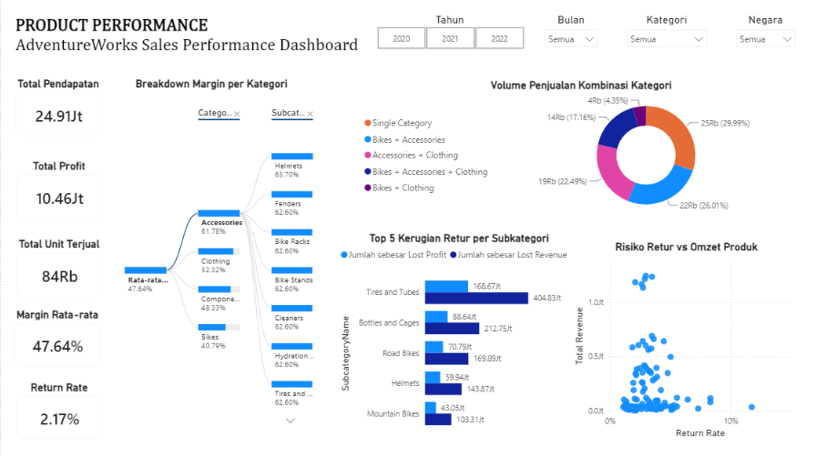

# 📊 Analisis Performa Ritel & Perilaku Pelanggan - AdventureWorks

Proyek *end-to-end data analytics* yang menganalisis tren penjualan, dinamika perilaku pelanggan, dan risiko retur produk pada peritel global **AdventureWorks** (periode Januari 2020 – Juni 2022). Proyek ini menggabungkan penggunaan **DB Browser for SQLite (SQL)** untuk transformasi data dan pemrosesan kueri, serta **Microsoft Power BI** untuk permodelan *Star Schema* dan visualisasi dashboard interaktif.

---

## 📌 Ringkasan Eksekutif

Analisis ini bertujuan untuk memberikan gambaran menyeluruh mengenai efisiensi operasional dan kinerja keuangan AdventureWorks. Dengan mengevaluasi lebih dari **25 ribu transaksi** dan **84 ribu unit produk terjual**, proyek ini mengidentifikasi pola pertumbuhan penjualan, tingkat retensi pembeli, kombinasi *cross-selling* antar kategori produk, serta potensi risiko pada rantai pasok dan kualitas barang untuk mendukung pengambilan keputusan bisnis yang berbasis data (*data-driven decision making*).

---

## 🛠️ Teknologi & Alat yang Digunakan

* **Database & Querying**: DB Browser for SQLite / SQLite (Pembersihan Data, Agregasi, *Window Functions*, & Analisis *Cross-Category*)
* **Business Intelligence & Visualization**: Microsoft Power BI Desktop
* **Permodelan Data**: *Star Schema* (*Fact Tables*: `Sales`, `Returns`; *Dimension Tables*: `Products`, `Customers`, `Territories`, `Calendar`)
* **Kalkulasi Bisnis**: DAX (*Time Intelligence*, *Dynamic Measures*, & *Iterative Functions*)

---

## 📁 Struktur Repositori

```text
adventureworks-sales-analysis/
│
├── dashboard/
│   └── adventureworks_sales_analysis.pbix
│
├── data/
│   └── adventureworks.db
│
├── images/
│   ├── sales_overview.png
│   ├── customer_performance.png
│   └── product_performance.png
│
├── sql/
│   ├── 01_kpi_metrics.sql
│   ├── 02_sales_trend.sql
│   ├── 03_customer_analysis.sql
│   └── 04_product_returns.sql
│
└── README.md
```

---

## 📊 Indikator Kinerja Utama (KPIs)
| Metrik Utama | Nilai | Deskripsi |
| :--- | :---: | :--- |
| **Total Revenue** | `$24,914,586.82` | Total pendapatan kotor dari seluruh transaksi |
| **Profit Margin** | `47.64%` | Tingkat efisiensi laba kotor perusahaan |
| **Total Orders** | `25,164` | Jumlah transaksi penjualan yang berhasil diproses |
| **Total Units Sold** | `84,174` | Total unit barang yang terjual |
| **Average Order Value (AOV)** | `$990.09` | Rata-rata nilai nominal per transaksi |
| **Total Customers** | `17,416` | Jumlah total pelanggan unik (*active buyers*) |
| **Overall Return Rate** | `2.17%` | Total retur 1,828 unit dari 84,174 unit terjual |


---


## 🖼️ Tampilan Dashboard Interaktif
### 1. Sales Performance Overview


Halaman ini menyajikan visualisasi makro terkait pencapaian omzet harian, tren pertumbuhan bulanan, serta kontribusi pendapatan berdasarkan wilayah geografis.

### 2. Customer Insights & Behavioral Analytics


Halaman ini berfokus pada segmentasi pembeli, tingkat retensi pembeli berulang (repeat customers), dan peta kombinasi kategori produk yang diminati pelanggan.

### 3. Product Performance & Risk Evaluation


Halaman ini mendeteksi profitabilitas per lini produk, volume penjualan barang, serta daftar produk yang memiliki angka retur tinggi.


---


## 🔍 Temuan Analisis Mendetail

### 1. Pertumbuhan Penjualan & Lonjakan Performa H1 (YoY)
* **Peningkatan Pendapatan Drastis:** Perbandingan kinerja pada Semester Pertama (Januari–Juni) antara tahun 2021 dan 2022 mencatatkan lonjakan omzet yang sangat signifikan sebesar **+211,07%**, meningkat dari `$2.952.867,55` (H1 2021) menjadi `$9.185.449,45` (H1 2022).
* **Ekspansi Volume Barang:** Pertumbuhan omzet ini berbanding lurus dengan kenaikan volume penjualan fisik pada H1, yang melesat dari **1.706 unit** (2021) menjadi **45.314 unit** (2022). Kenaikan kuantitas ini didorong secara dominan oleh penetrasi produk kategori *Accessories*.

### 2. Peran Kategori Produk: Revenue Engine vs Volume Driver
* **Kategori Sepeda (*Bikes*) sebagai Revenue Engine:** Kategori *Bikes* merupakan penyumbang pendapatan terbesar bagi perusahaan dengan nilai **$23.642.495,10** (94,9% dari total omzet). Masing-masing unit memiliki nilai jual rata-rata (*Average Selling Price*) yang tinggi sebesar **$1.697,36** per unit.
* **Kategori Aksesoris (*Accessories*) sebagai Volume Driver:** Kategori *Accessories* mendominasi volume kuantitas penjualan dengan porsi **68,7%** dari seluruh unit terjual (57.809 unit), meskipun harga jual rata-ratanya relatif terjangkau (**$15,68** per unit). Kategori ini berfungsi efektif sebagai produk pintu masuk (*entry product*) untuk menjangkau pelanggan baru.
* **Konsentrasi Risiko Produk Unggulan (*Hero Product Risk*):** Lini produk sepeda seri **Mountain-200** secara mandiri menyumbang **$7.170.946,50** atau menyerap sekitar **29%** dari total seluruh omzet perusahaan. Ketergantungan pada satu seri produk ini memerlukan perhatian khusus pada ketersediaan stok rantai pasok.

### 3. Analisis Retensi Pelanggan & Pola Belanja Silang (Cross-Selling)
* **Portofolio Pelanggan yang Sehat:** Top 10 pelanggan terbesar hanya berkontribusi sebesar **0,44%** ($110.268,65) terhadap total pendapatan kotor. Hal ini menunjukkan struktur bisnis yang sangat aman karena tidak bergantung pada segmen pembeli tunggal atau kelompok pembeli tertentu.
* **Pertumbuhan Pembeli Berulang (*Returning Customers*):** Dari total 9.133 pelanggan yang bertransaksi pada tahun 2021, sebanyak **2.397 pelanggan (26,25%)** kembali melakukan pembelian pada tahun 2022. Secara akumulatif, jumlah pembeli berulang pada tahun 2022 bertumbuh hingga mencapai **3.645 pelanggan**.
* **Sinergi Pembelian Silang (*Cross-Selling Synergy*):**
  * **4.421 pelanggan** tercatat membeli kombinasi kategori `Bikes + Accessories`.
  * **2.599 pelanggan** bertransaksi untuk kombinasi `Accessories + Clothing`.
  * **1.982 pelanggan** melakukan pembelian komprehensif pada ketiga kategori sekaligus (`Bikes + Accessories + Clothing`).

### 4. Evaluasi Kualitas Produk & Risiko Pengembalian Barang (Return Analysis)
Meskipun rata-rata retur keseluruhan bisnis berada pada angka yang relatif sehat (**2,17%**), analisis mendalam pada produk dengan volume penjualan di atas 100 unit menemukan beberapa item dengan tingkat pengembalian barang yang cukup tinggi (di atas 5%):

| Nama Produk | Kategori | Return Rate | Detail Retur |
| :--- | :---: | :---: | :--- |
| **Classic Vest, S** | Clothing | **5,10%** | 8 unit dikembalikan dari 157 unit terjual |
| **Women's Mountain Shorts, L** | Clothing | **5,09%** | 17 unit dikembalikan dari 334 unit terjual |
| **Road-150 Red, 44** | Bikes | **5,04%** | 7 unit dikembalikan dari 139 unit terjual |
| **Touring-1000 Yellow, 50** | Bikes | **4,79%** | 7 unit dikembalikan dari 146 unit terjual |

---

## 💻 Implementasi SQL (DB Browser for SQLite)

Berikut adalah contoh kueri SQL utama yang digunakan dalam proyek ini untuk mengekstraksi wawasan strategis dari database SQLite:

#### 1. Analisis Pertumbuhan Pendapatan H1 (YoY)
> Kueri ini memanfaatkan **Common Table Expression (CTE)** dan **Window Function `LAG()`** untuk membandingkan total omzet dan unit terjual pada periode Semester I secara tahunan.

```sql
WITH SalesH1 AS (
    SELECT 
        strftime('%Y', s.OrderDate) AS SalesYear,
        SUM(p.ProductPrice * s.OrderQuantity) AS Revenue,
        SUM(s.OrderQuantity) AS TotalUnits
    FROM Sales AS s
    JOIN AdventureWorks_Product_Lookup AS p ON s.ProductKey = p.ProductKey
    WHERE strftime('%m', s.OrderDate) BETWEEN '01' AND '06'
    GROUP BY SalesYear
)
SELECT 
    SalesYear, 
    Revenue, 
    TotalUnits,
    ROUND((Revenue - LAG(Revenue) OVER (ORDER BY SalesYear)) * 100.0 / LAG(Revenue) OVER (ORDER BY SalesYear), 2) AS RevenueGrowthPct
FROM SalesH1;
```

### 2. Segmen Pembelian Silang Antar-Kategori *(Cross-Sellling)*
> Kueri ini menggunakan teknik agregasi kondisional **MAX(CASE...)** untuk memetakan kombinasi kategori barang yang dibeli oleh setiap pelanggan unik.

```sql
WITH CustomerCategoryPurchase AS (
    SELECT 
        S.CustomerKey,
        MAX(CASE WHEN C.CategoryName = 'Bikes' THEN 1 ELSE 0 END) AS HasBikes,
        MAX(CASE WHEN C.CategoryName = 'Accessories' THEN 1 ELSE 0 END) AS HasAccessories,
        MAX(CASE WHEN C.CategoryName = 'Clothing' THEN 1 ELSE 0 END) AS HasClothing
    FROM Sales AS S
    JOIN AdventureWorks_Product_Lookup AS P ON P.ProductKey = S.ProductKey
    JOIN AdventureWorks_Product_Subcategories_Lookup AS SC ON P.ProductSubcategoryKey = SC.ProductSubcategoryKey
    JOIN AdventureWorks_Product_Categories_Lookup AS C ON SC.ProductCategoryKey = C.ProductCategoryKey
    GROUP BY S.CustomerKey
)
SELECT 
    CASE 
        WHEN HasBikes=1 AND HasAccessories=1 AND HasClothing=1 THEN 'Bikes + Accessories + Clothing'
        WHEN HasBikes=1 AND HasAccessories=1 THEN 'Bikes + Accessories'
        WHEN HasBikes=1 AND HasClothing=1 THEN 'Bikes + Clothing'
        WHEN HasAccessories=1 AND HasClothing=1 THEN 'Accessories + Clothing'
        ELSE 'Single Category Only'
    END AS CrossCategorySegment,
    COUNT(*) AS TotalCustomers
FROM CustomerCategoryPurchase
GROUP BY CrossCategorySegment
ORDER BY TotalCustomers DESC;
```

---

## 💡 Rekomendasi Strategis Bisnis

Berdasarkan temuan data di atas, berikut adalah rekomendasi langkah strategis yang dapat diterapkan oleh manajemen AdventureWorks:

1. **Otomatisasi Penawaran Bundling pada Sesi Checkout**  
   Mengingat tingginya keterkaitan antara pembelian *Bikes* dan *Accessories* (**4.421 pelanggan**), tim pemasaran disarankan untuk mengimplementasikan fitur rekomendasi otomatis (*add-on bundling*) pada platform e-commerce. Pelanggan yang membeli sepeda dapat langsung ditawari perlengkapan keselamatan terkait (seperti helm, pompa, atau tempat botol) untuk meningkatkan nilai rata-rata transaksi (*Average Order Value* / AOV).

2. **Evaluasi Panduan Ukuran & Kendali Mutu Produk Apparel**  
   Produk pakaian seperti *Classic Vest* dan *Women's Mountain Shorts* memiliki tingkat retur melebihi **5%**. Langkah perbaikan mencakup peninjauan ulang terhadap panduan ukuran (*sizing chart*) pada situs web, peningkatan kejelasan informasi bahan, serta inspeksi kontrol kualitas produk pada pabrikan untuk menekan biaya pengembalian barang.

3. **Penerapan Stok Pengaman (*Safety Stock*) untuk Produk Hero**  
   Seri *Mountain-200* memberikan kontribusi sebesar **29%** terhadap total pendapatan perusahaan. Tim perencanaan produksi dan pengendalian persediaan (PPIC) perlu memberlakukan pemantauan stok secara ketat dan menetapkan batas *safety stock* yang lebih tinggi untuk menghindari kondisi kehabisan stok (*stockout*) yang dapat mengganggu stabilitas arus kas bisnis.
